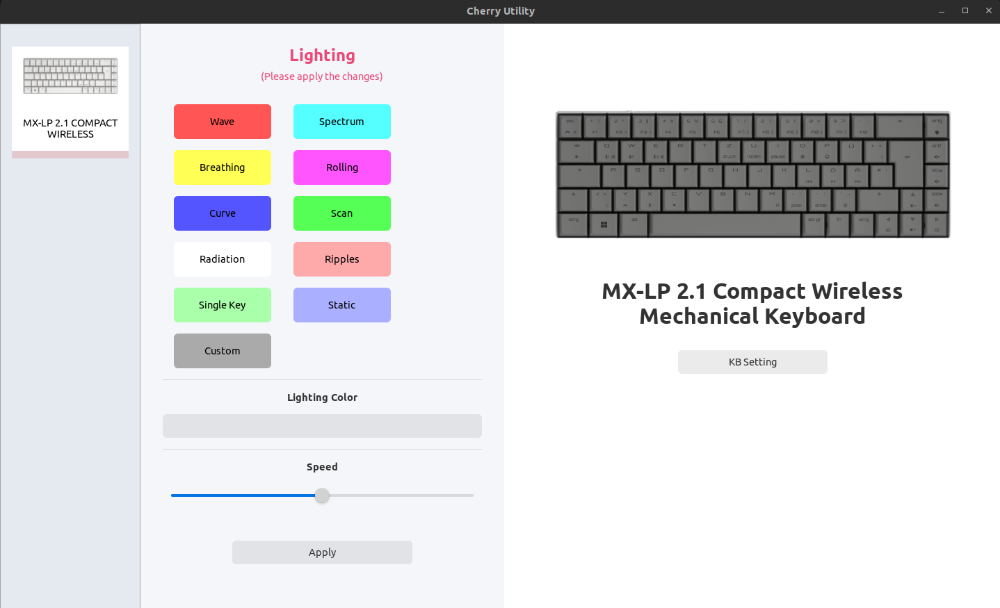

# Cherry MX-LP 2.1 Compact Wireless Keyboard Utility
## Project Overview
This project is my first foray into Rust, developed out of a necessity to configure my cherry keyboard on Linux, coupled with a keen interest in learning Rust.
So this project is a basic implementation for setting the backlight color for the Cherry MX-LP 2.1 Compact Wireless keyboard. 

## Inspiration and Learning Resources
The development process was guided by valuable resources that provided a foundation for understanding USB device interaction and application structure:

- ["Reverse Engineering a USB Device with Rust"](https://gill.net.in/posts/reverse-engineering-a-usb-device-with-rust/) by Nirav Gill, offered insights into reverse engineering techniques and USB communication protocols.

- The [g213_colours GitHub repository](https://github.com/shahzadnaeem/g213_colours) by Shahzad Naeem, demonstrated practical application of low-level keyboard configuration on Linux.

These resources were instrumental in overcoming initial challenges and served as a starting point for the project.

## Getting Started

These instructions will get you a copy of the project up and running on your local machine for development and testing purposes.



### Prerequisites

- Rust: You can download Rust from the official website [here](https://www.rust-lang.org/tools/install).

### Building

To build the project, navigate to the project directory and run:

```bash
cargo build
```

### Running
To run the project, use:
```bash
cargo run
```

## Planned Features

The following features are planned for future development:

- **Read Out Current Keyboard Settings**: Upon starting the application, the current keyboard settings will be read and displayed to the user.

- **Show Lighting Color / Speed Scaler Based on Animation Availability**: The application will display the lighting color and speed scaler, but this feature will only be available if configuration are supported by the animation.

- **Keyboard Setting Section**: A dedicated section will be added to the application's user interface for all keyboard-related settings.

- **Individual Key Color Configuration**: A feature will be implemented to allow users to set different colors for each key on the keyboard.