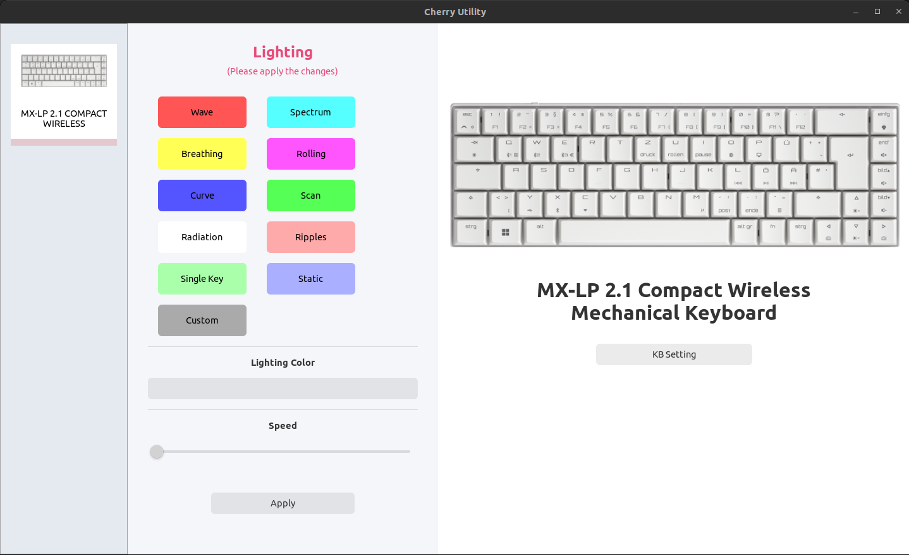

# Cherry MX-LP 2.1 Compact Wireless Keyboard Utility

This project is a basic implementation for setting the backlight color for the Cherry MX-LP 2.1 Compact Wireless keyboard. It is written in Rust and uses the GTK library for the user interface.

## Getting Started

These instructions will get you a copy of the project up and running on your local machine for development and testing purposes.



### Prerequisites

- Rust: You can download Rust from the official website [here](https://www.rust-lang.org/tools/install).

### Building

To build the project, navigate to the project directory and run:

```bash
cargo build
```

### Running
To run the project, use:
```bash
cargo run
```